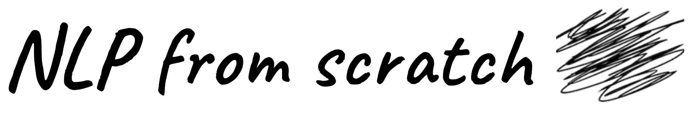
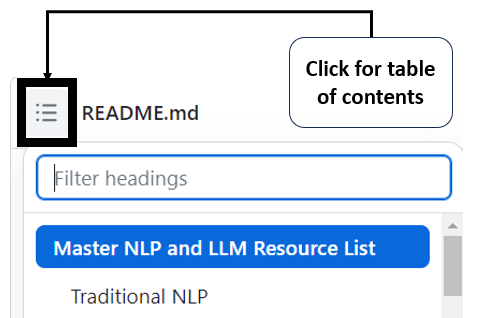

# Master NLP and LLM Resource List

This is the master resource list for [NLP from scratch](https://www.nlpfromscratch.com). This is a living document and will continually be updated and so should always be considered a work in progress. If you find any dead links or other issues, feel free to [submit an issue](https://github.com/nlpfromscratch/nlp-llms-resources/issues/new/choose).

This document is quite large, so you may wish to use the Table of Contents automatically generated by Github to find what you are looking for:

Thanks, and enjoy!

## Traditional NLP

### Datasets

* [nlp-datasets](https://github.com/niderhoff/nlp-datasets): Alphabetical list of free/public domain datasets with text data for use in Natural Language Processing (NLP)
* [awesome-public-datasets - Natural Language](https://github.com/awesomedata/awesome-public-datasets#natural-language): Natural language section of the awesome public datasets github page
* [SMS Spam Dataset:](https://archive.ics.uci.edu/dataset/228/sms+spam+collection) The “Hello World” of NLP datasets, ~55K SMS messages with label of spam/not spam for binary classification. Hosted on UC Irvine Machine Learning repository.
* [IMDB dataset:](https://ai.stanford.edu/~amaas/data/sentiment/) The other “Hello World” of datasets for NLP, 50K “highly polar” movie reviews scraped from IMDB and compiled by Andrew Maas of Stanford.
* [Twitter Airline Sentiment:](https://www.kaggle.com/datasets/crowdflower/twitter-airline-sentiment) Tweets from February of 2015 and associated sentiment labels at major US airlines - hosted on Kaggle (~3.5MB)
* [CivilCommentst](https://www.kaggle.com/c/jigsaw-unintended-bias-in-toxicity-classification/data): Dataset from the Civil Comments platform which shut down in 2017. 2M public comments with labels for toxicity, obscenity, threat, insulting, etc.
* [Cornell Movie Dialog](https://www.cs.cornell.edu/~cristian/Cornell_Movie-Dialogs_Corpus.html): ~220K conversations from 10K pairs of characters across 617 popular movies, compiled by Cristian Danescu-Niculescu-Mizil of Cornell. Tabular compiled format [available on Hugging Face](https://huggingface.co/datasets/cornell_movie_dialog).
* [CNN Daily Mail](https://github.com/abisee/cnn-dailymail): “Hello World” dataset for summarization, consisting of articles from CNN and Daily Mail and accompanying summaries. Also available through [Tensorflow](https://www.tensorflow.org/datasets/catalog/cnn_dailymail) and via [Hugging Face](https://huggingface.co/datasets/cnn_dailymail).
* [Entity Recognition Datasets](https://github.com/juand-r/entity-recognition-datasets): Very large list of named entity recognition (NER) datasets (on Github).
* [WikiNER](https://metatext.io/datasets/wikiner): 7,200 manually-labelled Wikipedia articles across nine languages: English, German, French, Polish, Italian, Spanish,Dutch, Portuguese and Russian.
* [OntoNotes](https://catalog.ldc.upenn.edu/LDC2013T19): Large corpus comprising various genres of text in three languages with structural information and shallow semantic information.
* [Flores-101](https://ai.meta.com/blog/the-flores-101-data-set-helping-build-better-translation-systems-around-the-world/) - Multilingual, multi-task dataset from Meta for machine translation research, focusing on “low resource” languages. Associated [Github repo](https://github.com/facebookresearch/flores/tree/main).
* [CulturaX](https://huggingface.co/datasets/uonlp/CulturaX): Open dataset of 167 languages with over 6T words, the largest multilingual dataset ever released
* [Amazon Review Datasets:](https://jmcauley.ucsd.edu/data/amazon/) Massive datasets of reviews from Amazon.com, compiled by Julian McAuley of University of California San Diego
* [Yelp Open Dataset](https://www.yelp.com/dataset): 7M reviews, 210K businesses, and 200K images released by Yelp. Note the educational license.
* [Google Books N-grams:](https://storage.googleapis.com/books/ngrams/books/datasetsv3.html) Very large dataset (2.2TB) of all the n-grams from Google Books. Also available hosted in an [S3 bucket by AWS](https://aws.amazon.com/datasets/google-books-ngrams/).
* [Sentiment Analysis @ Stanford NLP:](https://nlp.stanford.edu/sentiment/index.html) Includes a link to the dataset of movie reviews used for Stanford Sentiment Treebank 2 (SST2). Also available [on Hugging Face](https://huggingface.co/datasets/sst2).
* [CoNLL-2003](https://www.clips.uantwerpen.be/conll2003/ner/): Language-independent entity recognition dataset from the Conference on Computational Natural Language Learning (CoNLL-2003) shared task. Foundational datasets for named entity recognition (NER).  
* [LMSYS-Chat-1M: A Large-Scale Real-World LLM Conversation Dataset](https://huggingface.co/datasets/lmsys/lmsys-chat-1m): Large scale dataset of LLM 1M conversations with LLMs collected from Chatbot Arena website.
* [TabLib](https://www.approximatelabs.com/blog/tablib): Largest publicly available dataset of tabular tokens (627M tables, 867B tokens), to encourage the community to build Large Data Models that better understand tabular data
* [LAION 5B](https://laion.ai/blog/laion-5b/): Massive dataset of images and captions from Large-scale Artificial Intelligence Open Network (LAION), used to train Stable Diffusion.
* [Databricks Dolly 15K](databricks/databricks-dolly-15k): Instruction dataset compiled internally by Databricks, used to train the Dolly models based on the Pythia LLMs.
* [Conceptual Captions](https://ai.google.com/research/ConceptualCaptions/): Large image & caption pair dataset from Google research.
* [Instruction Tuning Volume 1](https://nlpnewsletter.substack.com/p/instruction-tuning-vol-1): List of popular instruction-tuning datasets from Sebastian Ruder
* [Objaverse](https://objaverse.allenai.org/): Massive dataset of annotated 3D objects (with associated text labels) from Allen Institute. Comes in two sizes: 1.0 (800K objects) and XL (~10M objects).
* [Gretel Synthetic Text to SQL Dataset](https://gretel.ai/blog/synthetic-text-to-sql-dataset): Open dataset of synthetically generated natural language and SQL query pairs for LLM training, from Gretel AI.
* [Fineweb](https://huggingface.co/datasets/HuggingFaceFW/fineweb): 15T token dataset of cleaned and deduplicated data from CommonCrawl by Hugging Face.

### Data Acquisition

* [API tutorials beyond OpenAPI](https://antonz.org/interactive-api-tutorials/): Detailed tutorial on the particulars of APIs and how they function. 
* [requests python library](https://requests.readthedocs.io/en/latest/): The standard library for making HTTP requests in python, simple and easy.
* [BeautifulSoup](https://www.crummy.com/software/BeautifulSoup/bs4/doc/): Python library for parsing data out of HTML, XML, and other markup documents. Essential for web scraping. 
* [Selenium Python bindings](https://selenium-python.readthedocs.io/): Working with Selenium in Python for more advanced web scraping.
* [Web scraping with ChatGPT prompts](https://proxiesapi.com/articles/web-scraping-using-chatgpt-complete-guide-with-examples): Medium post on working with ChatGPT to build web scraping code with requests, BeautifulSoup, and Selenium

### Libraries

* [Natural Language Toolkit (NLTK)](https://www.nltk.org/index.html): Core and essential NLP python library put together for teaching purposes by University of Pennsylvania, now fundamental to NLP work.
* [spaCy](https://spacy.io/): Fundamental python NLP library for “industrial-strength natural language processing”, focused on building production systems.
* [Gensim](https://radimrehurek.com/gensim/): open-source python library with a focus on topic modeling, semantic similarity, and embeddings. Also contains implementations of word2vec and doc2vec.
* [fastText](https://fasttext.cc/): Open-source, free, lightweight library that allows users to learn text representations (embeddings) and text classifiers. Includes [pre-trained word vectors](https://fasttext.cc/docs/en/english-vectors.html) from Wikipedia and Common Crawl. From Meta’s FAIR Group. 
* [KerasNLP](https://keras.io/keras_nlp/): Natural language processing with deep learning and LLMs in Keras using Tensorflow, Pytorch, or JAX. Includes models such as BERT, GPT, and OPT.
* [Tensorflow Text](https://www.tensorflow.org/text): Lower level than KerasNLP, text manipulation built into Tensorflow. 
* [Stanford CoreNLP](https://stanfordnlp.github.io/CoreNLP/): Java-based NLP library from Stanford, still important and in use
* [TextBlob](https://textblob.readthedocs.io/en/dev/): Easy to use NLP library in Python, including simple sentiment scoring and part-of-speech (POS) tagging.
* [Scikit-learn (sklearn):](https://scikit-learn.org/stable/) The essential library for doing machine learning in python, but more specifically [for working with text data](https://scikit-learn.org/stable/tutorial/text_analytics/working_with_text_data.html#extracting-features-from-text-files).
* [SparkNLP](https://nlp.johnsnowlabs.com/): Essential Big Data library for NLP work from John Snow Labs. Take a look at their [extensive model repo](https://sparknlp.org/models). Github repo with lots of resources [here](https://github.com/JohnSnowLabs/spark-nlp). Medium [post here](https://towardsdatascience.com/hands-on-googles-text-to-text-transfer-transformer-t5-with-spark-nlp-6f7db75cecff) on using the T5 model for classification with SparkNLP.

### Neural Networks / Deep Learning

* [A Recipe for Training Neural Networks](http://karpathy.github.io/2019/04/25/recipe/): Tips on training neural networks and debugging from Andrej Karpathy
* [Deep Learning for NLP in Pytorch:](https://github.com/rguthrie3/DeepLearningForNLPInPytorch/blob/master/Deep%20Learning%20for%20Natural%20Language%20Processing%20with%20Pytorch.ipynb) Detailed tutorial on applying NLP techniques with Pytorch, including LSTMs and embeddings.
* [Exploring LSTMs](http://blog.echen.me/2017/05/30/exploring-lstms/): A deep technical look into LSTMs and visualizations of what the networks “see”. 

### Sentiment Analysis

* [VADER: Valence Aware Dictionary and sEntiment Reasoner](https://github.com/cjhutto/vaderSentiment): A lexicon and rules-based sentiment scoring model, implemented in python. Used by other major NLP libraries (NLTK, spaCy, TextBlob, etc.)
* [PyABSA - Open Framework for Aspect-based Sentiment Analysis](https://github.com/yangheng95/pyabsa): Python library for aspect-based sentiment analysis
* [Explainable AI: Integrated Gradients:](https://databasecamp.de/en/ml/integrated-gradients-nlp) Detailed blog post on using the Integrated Gradients method from the [Alibi python library](https://docs.seldon.io/projects/alibi/en/stable/examples/integrated_gradients_imdb.html) for explainable ML on text.

### Optical Character Recognition (OCR)

* [Pytesseract](https://pypi.org/project/pytesseract/): Python wrapper for [Google’s Tesseract OCR engine](https://github.com/tesseract-ocr/tesseract).
* [Donut - Document understanding transformer](https://github.com/clovaai/donut): OCR-free end-to-end Transformer model for various visual document understanding tasks, such as visual document classification or information extraction. By Clova.ai research group.
* [Facebook Nougat](https://facebookresearch.github.io/nougat/): Neural Optical Understanding for Academic Documents (NOUGAT) is a Meta research project for specifically doing OCR and converting academic documents into a markup language. Available on Hugging Face spaces [here](https://huggingface.co/spaces/ysharma/nougat) and [here](https://huggingface.co/spaces/hf-vision/nougat-transformers). 
* [Amazon Textract:](https://aws.amazon.com/textract/) AWS Service for automatically extracting information from documents such as PDFs.
* [OCR with Google Document AI](https://codelabs.developers.google.com/codelabs/docai-ocr-python#0): Codelab demonstrating OCR on PDFs with GCP Document AI

### Information Extraction and NERD

* [RAKE](https://pypi.org/project/rake-nltk): Rapid Automatic Keyword Extraction, a domain independent keyword extraction algorithm which tries to determine key phrases in a body of text by analyzing the frequency of word appearance and its co-occurrence with other words in the text. 
* [YAKE](https://liaad.github.io/yake/): Yet Another Keyword Extractor is a light-weight unsupervised automatic keyword extraction method which rests on text statistical features extracted from single documents to select the most important keywords of a text.
* [Pytextrank](https://derwen.ai/docs/ptr/): Python implementation of [TextRank](https://web.eecs.umich.edu/~mihalcea/papers/mihalcea.emnlp04.pdf) and associated algorithms as a spaCy pipeline extension, for information extraction and extractive summarization.
* [PKE (Python Keyphrase Extraction)](https://github.com/boudinfl/pke): open source python-based keyphrase extraction toolkit, implementing a variety of algorithms. Uses spaCy.
* [KeyBERT](https://github.com/MaartenGr/KeyBERT): Keyword extraction technique that leverages BERT embeddings to create keywords and keyphrases that are most similar to a document.
* [UniversalNER](https://universal-ner.github.io): Targeted distillation model for named entity recognition from Microsoft Research and USC, based on data generated by ChatGPT.
* [SpanMarker](https://github.com/tomaarsen/SpanMarkerNER): Framework for NER models based on transformers such as BERT, RoBERTa and ELECTRA using Hugging Face Transformers ([HF page](https://huggingface.co/tomaarsen/span-marker-mbert-base-multinerd))

### Semantics and Syntax

* [Treebank](https://en.wikipedia.org/wiki/Treebank): Definition at Wikipedia
* [Universal Dependencies:](https://universaldependencies.org/#language-) Universal Dependencies (UD) is a framework for consistent annotation of grammar (parts of speech, morphological features, and syntactic dependencies) across different human languages.
* [UDPipe](https://lindat.mff.cuni.cz/services/udpipe/): UDPipe is a trainable pipeline for tokenization, tagging, lemmatization and dependency parsing of CoNLL-U files.

### Topic Modeling & Embedding

* [Topic Modeling](https://en.wikipedia.org/wiki/Topic_model): Wikipedia page
* [Latent Dirichlet Allocation (LDA):](https://en.wikipedia.org/wiki/Latent_Dirichlet_allocation) Wikipedia page
* [A Beginner’s Guide to Latent Dirichlet Allocation:](https://towardsdatascience.com/latent-dirichlet-allocation-lda-9d1cd064ffa2) TDS article with some easier to understand explanations of how LDA works.
* [Latent Semantic Analysis (LSA):](https://en.wikipedia.org/wiki/Latent_semantic_analysis) Wikipedia page
* [Termite:](https://idl.cs.washington.edu/papers/termite/) Python-based visualization framework for topic modeling 
* [Practical NLP Project](https://pnlpuos.github.io/topic-modeling): A nice overview of Topic Modeling as part of a project at Universität Osnabrück
* [Topic Modeling with Llama2](https://maartengrootendorst.substack.com/p/topic-modeling-with-llama-2): Post from Maarten Grootendorst on using Meta’s LLaMA 2 model and Hugging Face transformers for topic model 
* [BERTopic](https://maartengr.github.io/BERTopic/index.html): Topic modeling in Python using Hugging Face transformers and c-TF-IDF to create dense clusters, allowing for easily interpretable topics whilst keeping important words in the topic descriptions.
* [MTEB: Massive Text Embedding Benchmark:](https://github.com/embeddings-benchmark/mteb) General benchmark for LLM embedding performance.
* [Nomic Atlas](https://atlas.nomic.ai/): Project from Nomic AI to create high-performance browser-based visualizations of the embeddings of large datasets

### Multilingual NLP and Machine Translation:

* [fastText language identification models](https://fasttext.cc/docs/en/language-identification.html): Language identification models for use with fastText
* [SeamlessM4T:](https://ai.meta.com/blog/seamless-m4t/) Multimodal translation and transcription model based on the transformer architecture from Meta research.
    * Demo: [https://seamless.metademolab.com](https://seamless.metademolab.com/?utm_source=linkedin&utm_medium=organic_social&utm_campaign=seamless&utm_content=video)
    * Hugging Face space: [https://huggingface.co/spaces/facebook/seamless_m4t](https://huggingface.co/spaces/facebook/seamless_m4t)
    * Code: [https://github.com/facebookresearch/seamless_communication](https://github.com/facebookresearch/seamless_communication?utm_source=linkedin&utm_medium=organic_social&utm_campaign=seamless&utm_content=video)
* [Helsinki NLP Translation Models:](https://huggingface.co/Helsinki-NLP) Well-known and used translation models in Hugging Face from the University of Helsinki Language Technology Research Group, based on the [OPUS](https://github.com/Helsinki-NLP/Opus-MT) neural machine translation framework.
* [ACL 2023 Multilingual Models Tutorial](https://aka.ms/ACL2023tutorial): Microsoft’s presentations from ACL 2023 - a lot of dense content here on low resource languages, benchmarks, prompting, and bias.
* [ROUGE:](https://en.wikipedia.org/wiki/ROUGE_(metric)) Wikipedia page for ROUGE score for summarization and translation tasks.
* [BLEU](https://en.wikipedia.org/wiki/BLEU): Wikipedia page for BLEU machine translation tasks.
* [sacreBLEU](https://github.com/mjpost/sacrebleu): Python library for hassle-free and reproducible BLEU scores
* [XTREME](https://sites.research.google/xtreme):  Comprehensive benchmark for cross-lingual transfer learning on a diverse set of languages and tasks from researchers at Google and Carnegie Mellon
* [Belebele](https://github.com/facebookresearch/belebele): Multiple-choice machine reading comprehension (MRC) dataset spanning 122 language variants from Meta, based upon the Flores dataset
* [OpenNMT](https://opennmt.net): Open neural machine translation models in Pytorch and Tensorflow. Documentation for [python here](https://opennmt.net/OpenNMT-py/).
* [FinGPT-3](https://turkunlp.org/gpt3-finnish): GPT model trained in Finnish, from a research group at the University of Turku, Finland.
* [Jais 13-B](https://www.inceptioniai.org/jais/): Bilingual Arabic/English model based on GPT-3 architecture, from Inception AI / Core42 group in UAE.
* [Evo-LLM-JP](https://sakana.ai/evolutionary-model-merge/): Japanese LLM from AI startup Sakana.ai created using evolutionary model merging. There is a chat model, a vision model, and a stable diffusion model all of which can be prompted and converse in Japanese. On Hugging Face [here](https://huggingface.co/SakanaAI).

### Natural Language Inference (NLI) and Natural Language Understanding (NLU)

* [Adversarial NLI](https://github.com/facebookresearch/anli): Benchmark for NLI from Meta research and associated dataset.

### Interviewing 

* [NLP Interview Checklist](https://www.kaggle.com/discussions/getting-started/432875): Checklist of knowledge for interviewing for NLP roles. 

## Large Language Models (LLMs) and Gen AI

### Introductory LLMs

* [A Beginner’s Guide to Large Language Models](https://resources.nvidia.com/en-us-large-language-model-ebooks/llm-ebook-part1): Free e-book from NVIDIA covering some of the absolute fundamentals in plain language.
* [How AI chatbots like ChatGPT or Bard work – visual explainer](https://www.theguardian.com/technology/ng-interactive/2023/nov/01/how-ai-chatbots-like-chatgpt-or-bard-work-visual-explainer): A good short visual explainer from The Guardian on how embeddings works and make LLMs function.
* [Generative AI Primer](https://er.educause.edu/articles/2023/8/a-generative-ai-primer): A primer for the layperson on generative AI and LLMs, from Educause Review - lots of links to source materials here and well-written. 
* [Understanding Causal LLMs, Masked LLM’s, and Seq2Seq: A Guide to Language Model Training Approaches](https://medium.com/@tom_21755/understanding-causal-llms-masked-llm-s-and-seq2seq-a-guide-to-language-model-training-d4457bbd07fa): Medium post breaking down the different types of language modeling training approaches, causal language modeling vs masked language modeling (CLM vs MLM).
* [[1 hr Talk] Intro to Large Language Models](https://www.youtube.com/watch?v=zjkBMFhNj_g): Great short talk by Andrej Karpathy himself, covering the fundamentals of what LLMs are and how they are trained, demonstrations of GPT-4’s capabilities, and adversarial attacks & jailbreaks.

### Foundation Models

* [Explainer: What is a foundation model?](https://www.adalovelaceinstitute.org/resource/foundation-models-explainer/): A good and lengthy explainer and discussion of foundation models, including visuals and tables. From Ada Lovelace Institute.
* [Center for Research on Foundation Models (CRFM)](https://crfm.stanford.edu/): Interdisciplinary initiative born out of the Stanford Institute for Human-Centered Artificial Intelligence (HAI) that aims to make fundamental advances in the study, development, and deployment of foundation models. See the [report](https://crfm.stanford.edu/report.html), [transparency index](https://crfm.stanford.edu/fmti/), and their [master list of models](https://crfm.stanford.edu/helm/latest/?models=1) (increment using the URL).
* [Getting Started with Llama](https://ai.meta.com/llama/get-started/): Official getting started page for working with LLaMA 2 model from Meta.

### Text Generation

* [How to generate text: using different decoding methods for language generation with Transformers](https://huggingface.co/blog/how-to-generate): Overview of different text generation decoding methods from HuggingFace including beam search vs greedy, top-p and top-k sampling.
* [Guiding Text Generation with Constrained Beam Search in 🤗 Transformers](https://huggingface.co/blog/constrained-beam-search): Blog post from HF on using constrained Beam Search in transformers as opposed to regular beam search.
* [GPT in 60 lines of Numpy](https://jaykmody.com/blog/gpt-from-scratch/): Great blog post on building GPT from scratch and the fundamental workings of the decoder side of the transformer.
* Explanations of [Temperature](https://docs.cohere.com/docs/temperature) and [Top-p and Top-k sampling](https://docs.cohere.com/docs/controlling-generation-with-top-k-top-p#2-pick-from-amongst-the-top-tokens-top-k) Cohere documentation.
* [Creatively Deterministic: What are Temperature and Top P in Generative AI?](https://www.linkedin.com/pulse/creatively-deterministic-what-temperature-topp-ai-kevin-tupper/): LinkedIn post on temperature, top-p, and top-k
* [What is Temperature in NLP?](https://lukesalamone.github.io/posts/what-is-temperature/) A short explainer on temperature with a nice accompanying interactive visual, showing its effect on output probabilities.

### Web-based Chat Clients

* [ChatGPT](https://chat.openai.com/): Obviously. From OpenAI. Free, but requires an account.
* [Perplexity Labs](https://labs.perplexity.ai/): Free, web-based LLM chat client, no account required. Includes popular models such as versions of LLaMA and Mistral as well as Perplexity’s own pplx model.
* [HuggingChat](https://huggingface.co/chat): Chat client from HuggingFace, includes LLaMA and Mistral clients as well as OpenChat. Free for short conversations (in guest mode), account required for longer use.
* [DeepInfra Chat](https://deepinfra.com/chat): Includes LLaMA and Mistral, even Mixtral 8x7B! Free to use.
* [Pi](https://pi.ai/talk): Conversational LLM from Inflection. No account required.
* [Poe](https://poe.com/): AI assistant from Quora, allows interacting with OpenAI, Anthropic, LLaMA and Google models. Account required.
* [Copilot](https://copilot.microsoft.com/): Or is it Bing Chat? The lines are blurry. Backed by GPT, allows using GPT-4 on mobile ([iOS](https://apps.apple.com/us/app/microsoft-copilot/id6472538445), [Android](https://play.google.com/store/apps/details?id=com.microsoft.copilot&hl=en&gl=US)) for free! Requires a Microsoft account.

### Summarization

* [PEGASUS - A State-of-the-Art Model for Abstractive Text Summarization](https://blog.research.google/2020/06/pegasus-state-of-art-model-for.html): Foundational LLM for abstractive summarization from Google research in 2020. Available on Hugging Face [here](https://huggingface.co/google/pegasus-large).

### Fine-tuning LLMs

* [Fine-tuning Guide from OpenAI](https://platform.openai.com/docs/guides/fine-tuning): Official docs from OpenAI on fine-tuning hosted GPT-3.5-turb.
* [Getting Started with Deep Learning with PyTorch and Hugging Face](https://github.com/philschmid/deep-learning-pytorch-huggingface/tree/main): Lots of example notebooks for fine-tuning models (T5, Falcon, LLaMA) from Phil Schmid of Hugging Face
* [Fine-tune a non-English GPT-2 Model with Huggingface](https://www.philschmid.de/fine-tune-a-non-english-gpt-2-model-with-huggingface): “Hello World” example of fine-tuning a GPT2 model to write German recipes.
* [HuggingFace Community Resources:](https://huggingface.co/docs/transformers/community) Community resources from Hugging Face. A ton of free Colab notebooks here on fine-tuning various foundation models
* [Personal Copilot: Train Your Own Coding Assistant](https://huggingface.co/blog/personal-copilot): Blog post from Hugging Face on fine-tuning a code generating LLM, using both traditional fine-tuning and PEFT with StarCoder.
* [Optimizing Pre-Trained Models: A Guide To Parameter-Efficient Fine-Tuning (PEFT)](https://www.leewayhertz.com/parameter-efficient-fine-tuning/): A long guide on terminology and the particulars of different types of PEFT.
* [GPT 3.5 vs Llama 2 fine-tuning: A Comprehensive Comparison](https://ragntune.com/blog/gpt3.5-vs-llama2-finetuning): Short blog post comparing fine-tuning GPT vs. LLaMA 2 on a SQL code task, taking price into consideration.
* [Regression with Text Input Using BERT and Transformers](https://lajavaness.medium.com/regression-with-text-input-using-bert-and-transformers-71c155034b13): Fairly in-depth Medium post (including a lot of code) on using BERT for regression.
* [LongLoRA: Efficient Fine-tuning of Long-Context Large Language Models](https://huggingface.co/papers/2309.12307): Method for fine-tuning models (specifically LLaMA and Alpaca) to have longer context windows. Lots of resources around this on their [official Github page](https://github.com/dvlab-research/LongLoRA).  
* [PEFT](https://github.com/huggingface/peft): State-of-the-art Parameter-Efficient Fine-Tuning (PEFT) library in Hugging Face. methods. Official Github repo.
* [LoRA: Low-Rank Adaptation of Large Language Models](https://github.com/microsoft/LoRA): Official Github repo for LoRA from Microsoft.
* [Low-RanK Adapters (LoRA)](https://huggingface.co/docs/peft/conceptual_guides/lora): Conceptual guide from Hugging Face.
* [QLoRA](https://github.com/artidoro/qlora): Efficient Finetuning of Quantized LLMs, official Github repo. The method that produced Guanaco from LLaMA. 
* [Practical Tips for Finetuning LLMs Using LoRA (Low-Rank Adaptation)](https://magazine.sebastianraschka.com/p/practical-tips-for-finetuning-llms): List of tips and learnings based on using LoRA/QLoRA from Sebastian Raschka
* [Instruction Tuning Volume 1:](https://nlpnewsletter.substack.com/p/instruction-tuning-vol-1) Summary of instruction-tuning and links to some resources from Sebastian Ruder’s NLP newsletter.
* [Finetuning LLMs with LoRA and QLoRA: Insights from Hundreds of Experiments](https://lightning.ai/pages/community/lora-insights): Results of many experiments with model fine tuning using LoRA and QLoRA from Lightning AI, on memory and compute usage, training time, etc.
* [Overview of PEFT: State-of-the-art Parameter-Efficient Fine-Tuning](https://www.kdnuggets.com/overview-of-peft-stateoftheart-parameterefficient-finetuning): Article from KDNuggets with example code using LLaMA 7B
* [Llama Recipes](https://github.com/facebookresearch/llama-recipes): Recipes from Meta themselves for fine-tuning LLaMA
* [Axolotl](https://github.com/OpenAccess-AI-Collective/axolotl): Software framework for streamlining fine-tuning of LLMs from OpenAccess AI Collective.

### Model Quantization

* [Quantization:](https://huggingface.co/docs/optimum/concept_guides/quantization) Conceptual guide from Hugging Face
* [What are Quantized LLMs?](https://www.tensorops.ai/post/what-are-quantized-llms): Explainer post from TensorOps, including Hugging Face code and links to other resources.
* [7 Ways To Speed Up Inference of Your Hosted LLMs](https://betterprogramming.pub/speed-up-llm-inference-83653aa24c47): Medium post with techniques for speeding up Inference of LLMs, including an explainer on quantization.
* [HuggingFace meets bitsandbytes for lighter models on GPU for inference (Colab):](https://colab.research.google.com/github/huggingface/blog/blob/main/notebooks/HuggingFace_int8_demo.ipynb) Colab notebook demonstrating usage of bitsandbytes for model quantization with BLOOM 3B.

### Data Labeling

* [Label Studio](https://labelstud.io/): Open source python library / framework for data labelling 

### Code Examples and Cookbooks

* [OpenAI Cookbook:](https://cookbook.openai.com/) Recipes and tutorial posts for working and building with OpenAI, all in one place. Example code in the [Github repo](https://github.com/openai/openai-cookbook).
* [Cohere Guides](https://github.com/cohere-ai/notebooks/tree/main/notebooks/guides): Example notebooks for working with Cohere for various LLM usage cases.

### Local LLM Development

* [GPT4All](https://gpt4all.io): Locally-hosted LLM from Nomic for offline development. 
* [LM Studio](https://lmstudio.ai/): Software framework for local LLM development and usage.
* [Jan](https://jan.ai/): Offline GUI for working with LLMs. Mobile app under development.
* [Open WebUI](https://github.com/open-webui/open-webui): Self-hosted WebUI for LLMS to operate entirely offline - formly Ollama Web UI.
* [TransformerLab](https://github.com/transformerlab/transformerlab-app?tab=readme-ov-file): Open source project for GUI interface for working with LLMs locally. 
* [SuperWhisper](https://superwhisper.com/): Local usage of Whisper model on Mac OS, allows you to speak commands to your machine and have them transcribed (all locally).
* [Cursor](https://cursor.sh/): Locally installable code editor with autocomplete, chat, etc. backed by OpenAI GPT3.5/4.
* [llama.cpp](https://github.com/ggerganov/llama.cpp): Inference from Meta’s LLaMA model in pure C/C++. Python integration through [llama-cpp-python](https://llama-cpp-python.readthedocs.io/en/latest/).
* [Ollama](https://ollama.ai/): Host LLMs locally, includes models like LLaMA, Mistral, Zephyr, Falcon, etc.
* [Exploring Ollama for On-Device AI](https://pyimagesearch.com/2024/05/20/inside-look-exploring-ollama-for-on-device-ai/): Comprehensive tutorial on Ollama from PyImageSearch
* [llamafile](llamafile): Framework for LLMs as single executable files for local execution and development work, examples of one-liners and use from its creator here [Bash One-Liners for LLMs](https://justine.lol/oneliners/)
* [PowerInfer](https://github.com/SJTU-IPADS/PowerInfer): CPU/GPU LLM inference engine leveraging activation locality for fast on-device generation and serving of results from LLMs locally.
* [MLC LLM](https://llm.mlc.ai/): Native deployment of LLMs with native APIs with compiler acceleration. Includes [WebLLM](https://webllm.mlc.ai/) for serving LLMs through the browser and examples of locally developed Android and iPhone LLM apps.
* [DSPy](https://github.com/stanfordnlp/dspy): Framework for algorithmically optimizing LLM prompts and weights from Stanford NLP.
* [AnythingLLM](https://useanything.com/): Docker-based framework for offline LLM usage with RAG.

### Multimodal LLMs

#### Images

* [Stable Diffusion](https://stability.ai/stablediffusion): The open model from Stability AI that brought AI-generated images to the forefront. Official [Github repo here](https://github.com/CompVis/stable-diffusion), and (one of many) [Hugging Face Space](https://huggingface.co/spaces/stabilityai/stable-diffusion) here (for SD 2.1).
* [Deepfloyd Lab](https://www.deepfloyd.ai/): Multimodal research AI lab that is a part of Stability AI, has released the [IF Pixel Diffusion model](https://stability.ai/news/deepfloyd-if-text-to-image-model), which does much better on complex image generations such as those involving text.
* [Finetune Stable Diffusion Models with DDPO via TRL](https://huggingface.co/blog/trl-ddpo): Blog post from Hugging Face on fine-tuning SD with reinforcement learning and Denoising Diffusion Policy Optimization (DDPO).
* [Fast Stable Diffusion XL on TPU v5e](https://huggingface.co/spaces/google/sdxl): Hugging Face space with hosted SDXL on TPU for free and fast generation of high quality (1024x1024) images.
* [SDXL in 4 steps with Latent Consistency LoRAs](https://huggingface.co/blog/lcm_lora): Distilling Stable Diffusion XL with Latent Consistency LoRA for highly compute-optimized synthetic image generation.
* [DeciDiffusion](https://huggingface.co/Deci/DeciDiffusion-v1-0): Optimized SD 1.5 model from Deci.ai
* [Segmind-Distill-SD](https://blog.segmind.com/introducing-segmind-ssd-1b/): Distilled Stable Diffusion model from Segmind, claims 50% smaller and 60% faster. [Github repo here](https://github.com/segmind/distill-sd) & [Hugging Face model](https://huggingface.co/segmind/SSD-1B) here.  
* [Emu: Enhancing Image Generation Models Using Photogenic Needles in a Haystack AI](https://ai.meta.com/research/publications/emu-enhancing-image-generation-models-using-photogenic-needles-in-a-haystack): Fine-tuning of Stable Diffusion from Meta research focusing on high-quality images.
* [DreamBooth: Fine Tuning Text-to-Image Diffusion Models for Subject-Driven Generation](https://dreambooth.github.io/): Method for fine-tuning diffusion models to generate custom images of a subject based on samples.
* [AutoTrain Dreambooth (Colab)](https://colab.research.google.com/github/huggingface/autotrain-advanced/blob/main/colabs/AutoTrain_Dreambooth.ipynb#scrollTo=_LvIS7-7PcLT): Google Colab notebook for Autotraining Dreambooth models using Hugging Face.
* [Kosmos-G: Generating Images in Context with Multimodal Large Language Models](https://xichenpan.com/kosmosg/): Model from Microsoft Research for generating variations of images given text prompts with minimal to no training.
* [Multimodal LLMs by Chip Hyugen](https://huyenchip.com/2023/10/10/multimodal.html): A good post on multimodal LLMs, including foundational / historical models leading up to SOTA like CLIP and Flamingo.
* [LLaVA: Large Language and Vision Assistant](https://llava-vl.github.io/): A kind of open-source GPT4-V, chat / instruction agent able to work with image data, from researchers at Microsoft, U of Wisconsin, and Columbia. [Demo site is here](https://llava.hliu.cc/).
* [SPHINX](https://github.com/Alpha-VLLM/LLaMA2-Accessory/tree/main/SPHINX): Multimodal, multi-task LLM released by researchers at the University of Shanghai. [Demo is here](https://imagebind-llm.opengvlab.com/).
* [Ferret](https://github.com/apple/ml-ferret/): Open model from Apple for grounding and object identification.
* [XGen-MM](https://huggingface.co/collections/Salesforce/xgen-mm-1-models-662971d6cecbf3a7f80ecc2e): Continuation of (and rebranding) of Salesforce’s multimodal [BLIP](https://github.com/salesforce/BLIP?tab=readme-ov-file) model for image interrogation.

#### Audio

* [wav2vec 2.0](https://anwarvic.github.io/speech-recognition/wav2vec_2) And [w2v-BERT](https://anwarvic.github.io/speech-recognition/w2v-BERT): Explanations of the technical details behind these multimodal models from Meta’s FAIR group and Google Brain, by Mohamed Anwar
* [Musenet](https://openai.com/research/musenet): Older research from OpenAI, Musenet applied the GPT architecture to MIDI files to compose music.
* [AudioCraft:](https://ai.meta.com/resources/models-and-libraries/audiocraft/) Multiple models from Meta research, for music (MusicGen), sound effect (AudioGen), and a codec and diffusion model for recovering compressed audio (EnCodec and Multi-band Diffusion). Demo also available in a [Hugging Face space](https://huggingface.co/spaces/facebook/MusicGen), and a [sample Colab notebook here](https://huggingface.co/spaces/facebook/MusicGen/blob/main/demo.ipynb).
* [Audiobox](https://ai.meta.com/blog/audiobox-generating-audio-voice-natural-language-prompts/): Text-to-audio and speech prompt to audio from Meta. Interactive [demo site here](https://audiobox.metademolab.com/).
* [StableAudio](https://www.stableaudio.com/): Diffusion-based music generation model from Stability AI. [Blog post with technical details](https://stability.ai/research/stable-audio-efficient-timing-latent-diffusion).
* [SALMONN](https://github.com/bytedance/SALMONN): Speech Audio Language Music Open Neural Network from researchers at Tsinghua University and ByteDance. Allows for things like inquiring about the content of audio files, multilingual speech recognition & translation and audio-speech co-reasoning.
* Real-time translation and lip-synching: [https://blog.invgate.com/video-translator](https://blog.invgate.com/video-translator)
* [HeyGen](https://www.heygen.com/): Startup creating AI generated avatars and multimedia content, _e.g. _for instructional videos. [Video demo](https://www.youtube.com/watch?v=FRMDJzYO1k4) of lip-synching (dubbing) and translation.
* [Whisper](https://openai.com/research/whisper): OpenAI’s open source multilingual, text-to-speech transcription model. [Official Github repo](https://github.com/openai/whisper) with lots of details.
* [whisper_real_time](https://github.com/davabase/whisper_real_time): Example of real-time audio transcription using Whisper
* [whisper.cpp](https://github.com/ggerganov/whisper.cpp): High-performance plain C/C++ implementation of inference using OpenAI's Whisper without dependencies
* [Deepgram](https://deepgram.com/): Audio AI company with enterprise offerings for TTS including both their own Nova-2 model as well as Whisper or custom models.
* [AdaSpeech 4: Adaptive Text to Speech in Zero-Shot Scenarios](https://speechresearch.github.io/adaspeech4/): Model for realistic audio generation (text-to-speech / TTS) from researchers at Microsoft.
* [Project Gutenberg Audio Collection Project](https://marhamilresearch4.blob.core.windows.net/gutenberg-public/Website/index.html): Thousands of free audiobooks transcribed using AdaSpeech4, brought to you by Project Gutenberg, MIT, and Microsoft 
* [ElevenLabs](https://elevenlabs.io/): Well-known American software company with AI voice cloning and translation products.
* [Projects: Create High-Quality Audiobooks in Minutes](https://elevenlabs.io/blog/introducing-projects-create-high-quality-audiobooks-in-minutes): Tool for creating high-quality audiobooks via TTS from ElevenLabs.
* [Brain2Music](https://google-research.github.io/seanet/brain2music/): Research from Google for using fMRI scans to reconstruct audio perceived by the listener. 
* [WavJourney: Compositional Audio Creation with Large Language Models](https://audio-agi.github.io/WavJourney_demopage): An approach for generating audio combining generative text for scriptwriting plus audio generation models.
* [XTTS](https://coqui.ai/blog/tts/xtts_taking_tts_to_the_next_level): Voice cloning model specifically designed with game creators in mind from coqui.ai. Available in a [Hugging Face space here](https://huggingface.co/spaces/coqui/xtts-streaming).
* [The Future of Music - How Generative AI Is Transforming the Music Industry](https://a16z.com/the-future-of-music-how-generative-ai-is-transforming-the-music-industry/): Blog post from Anderssen-Horowitz covering a lot of recent developments in the intersection of the music industry and GenAI tools.
* [StyleTTS2](https://github.com/yl4579/StyleTTS2): Diffusion and adversarial model for realistic speech synthesis (TTS). Audio samples and comparisons with previous models are [here](https://styletts2.github.io/).
* [Qwen-Audio](https://qwen-audio.github.io/Qwen-Audio/): Multimodal audio understanding LLM from Alibaba Group
* [Audio Diffusion Pytorch](https://github.com/archinetai/audio-diffusion-pytorch): A fully featured audio diffusion library in PyTorch, from researchers at ElevenLabs.
* 

#### Video and Animation

* [Generative Image Dynamics](https://generative-dynamics.github.io/): Model from researchers at Google for creating looping images or interactive images from still ones. 
* [IDEFICS](https://huggingface.co/blog/idefics): Open multimodal text and image model from Hugging Face based on [Flamingo](https://deepmind.google/discover/blog/tackling-multiple-tasks-with-a-single-visual-language-model/), similar to GPT4-V. Updated version [IDEFICS 2](https://huggingface.co/blog/idefics2) released 04/2024 with [demo here](https://huggingface.co/spaces/HuggingFaceM4/idefics-8b).
* [NeRF](https://www.matthewtancik.com/nerf); Neural Radiance fields creates multiple views of a scene from a single image. 
* [ZipNeRF](https://jonbarron.info/zipnerf/): Building on NeRF with more advanced techniques and impressive results, generating drone-style “fly-by” videos from still images of settings.
* [Pegasus-1](https://app.twelvelabs.io/blog/introducing-pegasus-1): Multimodal model from TwelveLabs for describing videos and video-to-text generation.
* [Gen-2 by RunwayML](https://research.runwayml.com/gen2): Video-generating multimodal model from Runway ML that takes text or images as input. 
* [Replay](https://blog.genmo.ai/log/replay-ai-video): Video (animated picture) generating model from Genmo AI 
* [Hotshot XL](https://www.hotshot.co/): Text to animated GIF generator based on Stable Diffusion XL. [Github](https://github.com/hotshotco/Hotshot-XL) and [Hugging Face model page](https://huggingface.co/hotshotco/Hotshot-XL).
* [ModelScope](https://huggingface.co/damo-vilab/modelscope-damo-text-to-video-synthesis): Open model for text-to-video generation from Alibaba research
* [Stable Video Diffusion](https://stability.ai/news/stable-video-diffusion-open-ai-video-model): Generative video diffusion model  from Stability AI.
* [VideoPoet](https://sites.research.google/videopoet/): Synthetic video generation from Google Research, taking a variety of inputs (text, image, video).
* [Pika Labs](https://pika.art): AI startup for video creation with $55 million in backing.
* [Assistive Video](https://assistive.chat/product/video): Video generation from text from AI startup Assistive
* [Haiper](https://haiper.ai/): Text-to-video for short clips (2-4s) from Google Deepmind alumni. Free to use with an account.
* [MagicVideo-V2](https://magicvideov2.github.io/): Multi-Stage High-Aesthetic Video Generation. Text-to-video model from ByteDance research.

#### 3D Model Generation

* [Stable Zero123](https://stability.ai/news/stable-zero123-3d-generation): 3D image generation model from Stability AI building on the Zero123-XL model. Weights available for non-commercial use on [HF here](https://huggingface.co/stabilityai/stable-zero123).
* [DreamBooth3D](https://dreambooth3d.github.io/): Approach for generating high-quality custom 3D models from source images. 
* [MVDream:](https://mv-dream.github.io/gallery_0.html) 3D model generation from Diffusion from researchers at ByteDance.
* [TADA! Text to Animatable Digital Avatars](https://tada.is.tue.mpg.de): Research on models for synthetic generation of 3D avatars from text prompts, from researchers in China and Germany
* [TripoSR](https://github.com/vast-ai-research/triposr): Image to 3D generative model jointly developed by Tripo AI & Stability AI
* [Microdreamer](https://github.com/ml-gsai/microdreamer): Github repo for implementation of Zero-shot 3D Generation in ~20 Seconds from researchers at Renmin University of China

#### Powerpoint and Presentation Creation

* [Tome](https://tome.app/): Startup for AI-generated slides (Powerpoint). Free to signup.
* [Decktopus](https://www.decktopus.com/): “World’s #1 AI-Powered Presentation Generator”. Paid signup
* [Beautiful.ai](Beautiful.ai): Another AI-based slide deck generator (paid)

### Domain-specific LLMs

#### Code

* [Github Copilot](https://github.com/features/copilot): Github’s AI coding assistant, based on OpenAI’s Codex model.
* [GitHub Copilot Fundamentals - Understand the AI pair programmer](https://learn.microsoft.com/en-us/training/paths/copilot/|): Introductory online training / short course on Copilot from Microsoft.
* [Gemini Code Assist:](https://cloud.google.com/gemini/docs/codeassist/overview) Code assistant from Google based on Gemini. Available in Google Cloud or in local IDEs via a plugin (requires subscription).
* [CodeCompose](https://techcrunch.com/2023/05/18/meta-built-a-code-generating-ai-model-similar-to-copilot/): (TechCruch article): Meta’s internal coding LLM / answer to Copilot 
* [CodeInterpreter:](https://openai.com/blog/chatgpt-plugins#code-interpreter) Experimental ChatGPT plugin that provides it with access to executing python code.
* [StableCode](https://stability.ai/blog/stablecode-llm-generative-ai-coding): Stability AI’s generative LLM coding model. Hugging Face [collection here](https://huggingface.co/collections/stabilityai/stablecode-64f9dfb4ebc8a1be0a3f7650). Github [here](https://github.com/Stability-AI/StableCode).
* [Starcoder](https://huggingface.co/blog/starcoder): Coding LLM from Hugging Face. Github [is here](https://github.com/bigcode-project/starcoder). **Update**: [Starcoder 2](https://huggingface.co/blog/starcoder2) has been released as of Feb 2024!
* [CodeQwen-1.5](https://qwenlm.github.io/blog/codeqwen1.5/): Code-specific version of Alibaba’s Qwen model. 
* [Ghostwriter](https://replit.com/site/ghostwriter): an AI-powered programming assistant from Replit AI.
* [DeciCoder 1B](https://huggingface.co/Deci/DeciCoder-1b): Code completion LLM from Deci AI, trained on Starcoder dataset. 
* [SQLCoder](https://github.com/defog-ai/sqlcoder): Open text-to-SQL query models fine-tuned on Starcoder, from Defog AI. Demo [is here](https://defog.ai/sqlcoder-demo/).
* [CodeLLama](https://ai.meta.com/blog/code-llama-large-language-model-coding/): Fine-tuned version of LLaMA 2 for coding tasks, from Meta.
* [Refact Code LLM](https://refact.ai/blog/2023/introducing-refact-code-llm/): 1.6B coding LLM with fill-in-the-middle (fim) capability, trained by Refact AI.
* [Tabby](https://tabby.tabbyml.com/): Open source, locally-hosted coding assistant framework. Can use Starcoder or CodeLLaMA.
* [DuetAI for Developers](https://cloud.google.com/blog/products/application-development/introducing-duet-ai-for-developers): Coding assistance based on PaLM as part of Google’s DuetAI offering. 
* [Gorilla LLM](https://gorilla.cs.berkeley.edu/): LLM model from researchers at UC Berkeley trained to generate API calls across many different platforms and tools.
* [Deepseek Coder](https://deepseekcoder.github.io): Series of bilinginual English/Chinese coding LLMs from DeepSeek AI, trained from scratch on 2T tokens, with a composition of 87% code and 13% natural language.
* [Phind 70B](https://www.phind.com/blog/introducing-phind-70b): Code generation model purported to rival GPT-4 from AI startup Phind.
* [Granite](https://research.ibm.com/blog/granite-code-models-open-source?utm_source=tldrai): Open-sourced family of code-specific LLMs from IBM Research. On Hugging Face [here](https://huggingface.co/collections/ibm-granite/granite-code-models-6624c5cec322e4c148c8b330).

#### Mathematics

* [MathGLM](https://github.com/THUDM/MathGLM): Open model from Tsinghua University researchers challenging the statement that LLMs cannot do mathematics well. Nonetheless, [math remains hard if you’re an LLM](https://garymarcus.substack.com/p/math-is-hard-if-you-are-an-llm-and).
* [Llemma: An Open Language Model For Mathematics](https://blog.eleuther.ai/llemma): Fine-tuned version of CodeLLaMA on new dataset [Proof-Pile-2](https://huggingface.co/datasets/EleutherAI/proof-pile-2) from Eleuther AI, a mixture of scientific papers and mathematical web content.

#### Finance

* [BloombergGPT](https://www.bloomberg.com/company/press/bloomberggpt-50-billion-parameter-llm-tuned-finance/): LLM trained by Bloomberg from scratch based on code / approaches from BLOOM
* [FinGPT](https://github.com/AI4Finance-Foundation/FinGPT): Finance-specific family of models trained with RLHF, fine-tuned from various base foundation models.
* [DocLLM](https://arxiv.org/pdf/2401.00908.pdf): Layout-aware large language moel from JPMorgan

#### Science and Health

* [Galactica](https://www.technologyreview.com/2022/11/18/1063487/meta-large-language-model-ai-only-survived-three-days-gpt-3-science/): (MIT Blog Post) Learnings from Meta’s Galactica LLM, trained on scientific research papers.
* [BioGPT](https://github.com/microsoft/BioGPT): Generative Pre-trained Transformer for Biomedical Text Generation and Mining, open LLM from Microsoft Research trained on PubMeb papers.
* [MedPALM](https://sites.research.google/med-palm/): A large language model from Google Research, designed for the medical domain. Google has continued this work with [MedLM](https://cloud.google.com/blog/topics/healthcare-life-sciences/introducing-medlm-for-the-healthcare-industry),
* [Meditron](https://arxiv.org/abs/2311.16079): Fine-tuned LLaMAs on medical data from Swiss university EPFL. HuggingFace space [here](https://huggingface.co/epfl-llm/meditron-70b). Github [here](https://github.com/epfLLM/meditron). [Llama3 version](https://meditron-ddx.github.io/llama3-meditron.github.io/) released 2024/04/19.
* [MedicalLLM](https://huggingface.co/blog/leaderboard-medicalllm): Evaluation benchmark for medical LLMs from Hugging Face including leaderboard.

#### Law

* [SaulLM-7B](https://arxiv.org/abs/2403.03883): Legal LLM from researchers at Equall.ai and other universities. A fine-tune of Mistral-7B trained on a legal corpus of over 30B tokens. 

#### Time Series

* [TimeGPT](https://www.nixtla.io/timegpt): Transformer-based time series prediction models from NIXTLA. Requires using their service / an API token.
* [Lag-Llama](https://github.com/time-series-foundation-models/lag-llama): Towards Foundation Models for Probabilistic Time Series Forecasting. Open-source foundation model for time series forecasting based on the transformer architecture.
* [Granite](https://research.ibm.com/blog/granite-code-models-open-source?utm_source=tldrai): Time-series versions of open-sourced family of LLMs from IBM Research. On Hugging Face [here](https://huggingface.co/collections/ibm-granite/granite-time-series-models-663a90c6a2da73482bce3dc6).

### Vector Databases and Frameworks

* [Docarray](https://docarray.jina.ai/): python library for nested, unstructured, multimodal data in transit, including text, image, audio, video, 3D mesh, and so on.
* [Faiss](https://faiss.ai/): Library for efficient similarity search and clustering of dense vectors from Meta Research.
* [Pinecone](https://www.pinecone.io/): Vector database is a vector-based database that offers high-performance search and similarity matching.
* [Weaviate](https://weaviate.io/): Open-source vector database to store data objects and vector embeddings from your favorite ML-models.
* [Chroma](https://www.trychroma.com/): Open-source vector store used for storing and retrieving vector embeddings and metadata for use with large language models.
* [Milvus](https://milvus.io/): Vector database built for scalable similarity search.
* [AstraDB](https://www.datastax.com/products/datastax-astra): Datastax’s vector database offering built atop of Apache Cassandra.
* [Activeloop](https://www.activeloop.ai/): Database for AI powered by a unique storage format optimized for deep-learning and Large Language Model (LLM) based applications.
* [OSS Chat](https://osschat.io/): Demo of RAG from Zilliz, allowing chat with OSS documentation.

### Evaluation

* [The Stanford Natural Language Inference (SNLI) Corpus](https://nlp.stanford.edu/projects/snli/): Foundational dataset for NLI-based evaluation, 570k human-written English sentence pairs manually labeled for balanced classification with the labels entailment, contradiction, and neutral.
* [GLUE](https://gluebenchmark.com/): General Language Understanding Evaluation Benchmark from NYU, University of Washington, and Google - model evaluation using Natural Language Inference (NLI) tasks.
* [SuperGLUE](https://super.gluebenchmark.com/): The Super General Language Understanding Evaluation, a new benchmark styled after GLUE with a new set of more difficult language understanding tasks, improved resources, and a new public leaderboard.
* [SQuAD (Stanford Question Answering Dataset)](https://rajpurkar.github.io/SQuAD-explorer/): Reading comprehension question answering dataset for LLM evaluation.
* [BigBench](https://github.com/google/BIG-bench): The Beyond the Imitation Game Benchmark (BIG-bench) from Google, a collaborative benchmark with over 200 tasks.
* [BigBench Hard](https://github.com/suzgunmirac/BIG-Bench-Hard): Subset of BigBench tasks considered to be the most challenging, with associated paper.
* [MMLU](https://github.com/hendrycks/test): Multi-task Language Understanding is a benchmark developed by researchers at UC Berkeley and others to specifically measure knowledge acquired during pretraining by evaluating models exclusively in zero-shot and few-shot settings.
* [HeLM](https://crfm.stanford.edu/helm/latest/): Holistic Evaluation of Language Models, a “living” benchmark designed to be comprehensive, from the Center for Research on Foundation Models (CRFM) at Stanford.
* [HellaSwag](https://rowanzellers.com/hellaswag/): a challenge dataset for evaluating commonsense NLI that is specially hard for state-of-the-art models, though its questions are trivial for humans (>95% accuracy).
* [Dynabench](https://dynabench.org/): A “platform for dynamic data collection and benchmarking”. Sort of a Kaggle / collaborative site for benchmarks and data collaboration, an effort of researchers from Meta and American universities.
* [LMSys Chatbot Area:](https://huggingface.co/spaces/lmsys/chatbot-arena-leaderboard) Leaderboard from LMSys group based upon human evaluation and Elo score. The only evaluation that [Andrej Karpathy trusts](https://www.reddit.com/r/LocalLLaMA/comments/18n3ar3/karpathy_on_llm_evals/).
* [Hugging Face Open LLM Leaderboard](https://huggingface.co/spaces/HuggingFaceH4/open_llm_leaderboard): Leaderboard from H4 (alignment) Group at Hugging Face. Largely open and fine-tuned models, though this can be filtered.
* [AlpacaEval Leaderboard](https://tatsu-lab.github.io/alpaca_eval/): AlpacaEval an LLM-based automatic evaluation based on the AlpacaFarm evaluation set, which tests the ability of models to follow general user instructions.
* [OpenCompass](https://opencompass.org.cn/leaderboard-llm): Leaderboard for Chinese LLMs.
* [Evaluating LLMs is a minefield](https://www.cs.princeton.edu/~arvindn/talks/evaluating_llms_minefield/): Popular deck from researchers at Princeton (and authors of AI Snake Oil) on the pitfalls and intricacies of evaluating LLMs. 
* [LM Contamination Index](https://hitz-zentroa.github.io/lm-contamination/): The LM Contamination Index is a manually created database of contamination of LLM evaluation benchmarks.
* [The Curious Case of LLM Evaluation](https://nlpurr.github.io/posts/case-of-llm-evals.html): In depth blog post, examining some of the finer nuances and sticking points of evaluating LLMs. 
* [LLM Benchmarks](https://benchmarks.llmonitor.com/): Dynamic dataset of crowd-sourced prompt that changes weekly for more realistic LLM evaluation.
* [Language Model Evaluation Harness](https://github.com/EleutherAI/lm-evaluation-harness): EleutherAI’s language model evaluation harness, a unified framework to test generative language models on over 200 different evaluation tasks.
* [PromptBench](https://github.com/microsoft/promptbench): Unified framework for LLM evaluation from Microsoft.
* [HarmBench](https://www.harmbench.org/about): Standardized evaluation framework for automated red teaming for mitigating risks associated with malicious use of LLMs. Paper [on arxiv](https://arxiv.org/abs/2402.04249).

### Agents

* [AutoGPT](https://github.com/Significant-Gravitas/AutoGPT): One of the most popular frameworks for using LLM agents, using the OpenAI API / GPT4.
* [ThinkGPT](https://github.com/jina-ai/thinkgpt): python library for implementing Chain of Thoughts for LLMs, prompting the model to think, reason, and to create generative agents.
* [AutoGen](https://microsoft.github.io/autogen/): Multi-agent LLM framework for building applications from Microsoft.
* [XAgent](https://blog.x-agent.net/): Open-source experimental agent, designed to be a general-purpose and applied to a wide range of tasks. From students at Tsinghua University.
* [Thought Cloning](https://github.com/ShengranHu/Thought-Cloning): Github repo for implementation of Thought Cloning (TC), an imitation learning framework by training agents to think like humans.
* [Demonstrate-Search-Predict (DSP)](https://github.com/stanfordnlp/dsp): framework for solving advanced tasks with language models (LMs) and retrieval models (RMs). 
* [ReAct Framework](https://www.promptingguide.ai/techniques/react): Prompting method includes examples with actions, the observations gained by taking those actions, and transcribed thoughts (reasoning) for LLMs to take complex actions and reason or solve problems.
* [Tree of Thoughts (ToT)](https://github.com/princeton-nlp/tree-of-thought-llm): LLM reasoning process as a tree, where each node is an intermediate "thought" or coherent piece of reasoning that serves as a step towards the final solution.
* [GPT Engineer](https://github.com/AntonOsika/gpt-engineer): Python framework for attempting to get GPT to write code and build software.
* [MetaGPT - The Multi-Agent Framework](https://github.com/geekan/MetaGPT): Agent framework where different assigned roles (product managers, architects, project managers, engineers) are used for building different products (user stories, competitive analysis, requirements, data structures, etc.) given a requirement.
* [OpenGPTs](https://github.com/langchain-ai/opengpts): Open source effort from Langchain to create a similar experience to OpenAI's GPTs with greater flexibility and choice.
* [Devin](https://www.cognition-labs.com/introducing-devin): “AI software engineer” from startup Cognition Labs.
* [SWE-Agent:](https://swe-agent.com/) Open source software engineering agent framework from researchers at Princeton.
* [GATO](https://www.deepmind.com/publications/a-generalist-agent): Generalist agent from Google Deepmind research for many tasks and media types
* [WebLLaMa](https://webllama.github.io/): Fine-tuned version of LLaMa 3 from McGill University and optimized for web browsing tasks..

### Application Frameworks:

* [LlamaIndex](https://gpt-index.readthedocs.io/en/latest/):LlamaIndex (formerly GPT Index) is a data framework for LLM applications to ingest, structure, and access private or domain-specific data. Usedl for RAG and building LLM applications working with stored data.
* [LangChain](https://python.langchain.com/docs/get_started/introduction.html): LangChain is a framework for developing applications powered by language models.
* [Chainlit](https://docs.chainlit.io/get-started/overview): Chainlit is an open-source Python package that makes it incredibly fast to build ChatGPT-like applications with your own business logic and data. 

### LLM Training, Training Frameworks, Training at Scale

* [Deepspeed](https://www.microsoft.com/en-us/research/project/deepspeed/): Deep learning optimization software suite that enables unprecedented scale and speed for DL Training and Inference from Microsoft.
* [Megatron-LM](https://github.com/NVIDIA/Megatron-LM): From NVIDIA, Megatron-LM enables training large transformer language models with efficient tensor, pipeline and sequence-based model parallelism for pre-training transformer based language models.
* [GPT-NeoX](https://github.com/EleutherAI/gpt-neox): Eleuther AI’s library for large scale GPU training of LLMs, based on Megatron.
* [TRL (Transformer Reinforcement Learning)](https://pypi.org/project/trl/): Library for Reinforcement Learning of Transformer and Stable Diffusion models built atop of the transformers library.
* [Autotrain Advanced](https://huggingface.co/docs/autotrain/index): In development offering and [python library](https://github.com/huggingface/autotrain-advanced) from Hugging Face for easy and fast auto-training of LLMs and Stable Diffusion models. 
* [Transformer Math: ](https://www.eleuther.ai/mathematics/transformer_math/)Detailed blog post from Eleuther AI on the mathematics of compute requirements for training LLMs

### Reinforcement Learning from Human Feedback (RLHF)

* [Reinforcement Learning from Human Feedback:](https://en.wikipedia.org/wiki/Reinforcement_learning_from_human_feedback) ELI5 from Wikipedia
* [RLHF: Reinforcement Learning from Human Feedback](https://huyenchip.com/2023/05/02/rlhf.html): Blog post from Chip Hyugen on breaking down RLHF.
* [Illustrating Reinforcement Learning from Human Feedback (RLHF)](https://huggingface.co/blog/rlhf): Blog post from Hugging Face breaking down how RLHF works with accompanying visuals.

### Embeddings

* [The Illustrated Word2vec](https://jalammar.github.io/illustrated-word2vec/): Explanation of word2vec from Jay Allamar
* [Sentence Transformers](https://www.sbert.net/): Python framework for state-of-the-art sentence, text and image embeddings from Siamese BERT networks. 
* [Text Embeddings](https://docs.cohere.com/docs/text-embeddings): Documentation / explainer from Cohere with accompanying video.
* [Text Embeddings Visually Explained](https://txt.cohere.com/text-embeddings/): Another Cohere post explaining the intuition and use cases behind text embeddings.
* [A Deep Dive into NLP Tokenization and Encoding with Word and Sentence Embeddings](https://datajenius.com/2022/03/13/a-deep-dive-into-nlp-tokenization-encoding-word-embeddings-sentence-embeddings-word2vec-bert/): Lengthy blog post going into detail on embeddings from a deep learning fundamentals perspective and building up to word2vec and BERT.

### LLM Serving

* [vLLM](https://github.com/vllm-project/vllm): vLLM is a fast and easy-to-use library for LLM inference and serving, using Paged Attention for working in parallel.
* [Skypilot](https://github.com/skypilot-org/skypilot): SkyPilot is a framework for running LLMs, AI, and batch jobs on any cloud.
* [7 Frameworks for Serving LLMs](https://betterprogramming.pub/frameworks-for-serving-llms-60b7f7b23407): Medium post comparing different LLM serving frameworks.
* [Deploying custom fine-tuned LLMs on Vertex AI](https://medium.com/@ashika.umanga/deploying-custom-fine-tuned-llms-on-vertex-ai-6f96752f9fc1#:~:text=These%20can%20be%20easily%20deployed%20and%20used%20for%20inference.&text=Models%20in%20the%20Registry%20are,traffic-split%20can%20be%20configured): Medium post with a how-to on serving LLMs via GCP and Vertex AI

### Preprocessing and Tokenization

* [Tiktoken](https://github.com/openai/tiktoken): OpenAI’s BPE-based tokenizer 
* [SentencePiece](https://github.com/google/sentencepiece): Unsupervised text tokenizer and detokenizer for text generation systems from Google (but not an official product).

### Open LLMs

* [LLaMa 2](https://llama.meta.com/): Incredibly popular open weights (with license) model from Meta AI which spawned a generation of offspring and fine-tunes. Comes in 7, 13, and 70B versions.
* [Mistral 7B](https://mistral.ai/news/announcing-mistral-7b/): Popular open model from French startup Mistral with no fine-tuning (only pretraining). See also: the [Mixtral 8x7B](https://mistral.ai/news/mixtral-of-experts/) mixture of experts successor, [Mixtral 8x22B](https://huggingface.co/mistral-community/Mixtral-8x22B-v0.1-4bit)
* [Gemma](https://blog.google/technology/developers/gemma-open-models/): Lightweight open models from Google based on the same architecture as Gemini. Comes in 2B and 7B base and instruction-tuned versions.
* [GPT-J](https://huggingface.co/EleutherAI/gpt-j-6b) and [GPT Neo-X](https://huggingface.co/EleutherAI/gpt-neox-20b): Open model trained from scratch by Eleuther AI.
* [Falcon 40B](https://falconllm.tii.ae/): Open text generation LLM from UAE’s Technology Innovation Institute (TII). Available on Hugging Face [here](https://huggingface.co/tiiuae/falcon-40b).
* [Falcon 2 11B](https://falconllm.tii.ae/falcon-2.html): Second set of models in the series from TII, released May 2024, including a multimodal model. On Hugging Face [here](https://huggingface.co/tiiuae/falcon-11B)c.
* [StableLM](https://github.com/stability-AI/stableLM/): Open language model from Stability AI. Succeeded by StableLM 2, in [1.6B](https://stability.ai/news/introducing-stable-lm-2) (Jan 2024) and [12B versions](https://stability.ai/news/introducing-stable-lm-2-12b) (April 2024, try [live demo here](https://huggingface.co/spaces/stabilityai/stablelm-2-chat))  
* [OLMo](https://allenai.org/olmo): Open Language Models from the Allen Institute for AI (AI2)
* [Snowflake Arctic](https://www.snowflake.com/blog/arctic-open-efficient-foundation-language-models-snowflake/): Open LLM from Snowflake, released April 2024. [Github here](https://github.com/Snowflake-Labs/snowflake-arctic) and on [Hugging Face here](https://huggingface.co/Snowflake).
* [Minotaur 15B](https://huggingface.co/openaccess-ai-collective/minotaur-15b): Fine-tuned version of Starcoder on open code datasets from the OpenAccess AI Collective
* [MPT](https://www.mosaicml.com/mpt): Family of open models free for commercial use from MosaicML. Includes [MPT Storywriter](https://huggingface.co/mosaicml/mpt-7b-storywriter) which has a 65K context window.
* [DBRX](https://www.databricks.com/blog/introducing-dbrx-new-state-art-open-llm): Family of mixture-of-experts (MoE) large language model trained from scratch by Databricks Mosaic Research. Try it out in the Hugging Face [playground here](https://huggingface.co/spaces/databricks/dbrx-instruct).
* [Qwen](https://github.com/QwenLM/Qwen): Open LLM models from Alibaba Cloud in 7B and 14B sizes, including chat versions. Model family [1.5 released Feb 2024](https://github.com/QwenLM/Qwen1.5) and [Qwen1.5-MoE](https://qwenlm.github.io/blog/qwen-moe/) Mixture of Experts model released 03/28/2024.
* [Command-R](https://txt.cohere.com/command-r/) / [Command-R+](https://txt.cohere.com/command-r-plus-microsoft-azure/): Open LLM from Cohere for AI for long-context tasks such as retrieval augmented generation (RAG) and tool use. Available on HuggingFace [Command-R](https://huggingface.co/CohereForAI/c4ai-command-r-v01), [Command-R+](https://huggingface.co/CohereForAI/c4ai-command-r-plus)
* [Aya](https://cohere.com/research/aya): Massively multilingual models from Cohere for AI, [Aya 101](https://huggingface.co/CohereForAI/aya-101) and 23 which support those many languages respectively each. [Aya 23](https://huggingface.co/collections/CohereForAI/c4ai-aya-23-664f4cda3fa1a30553b221dc) comes in 8B and 35B versions. 
* [Grok-1](https://github.com/xai-org/grok-1): X.ai’s LLM, an MoE with 314B parameters, weights available via torrent. This is the (pre-trained) base model only, and not fine-tuned for chat.
* [Jamba](https://www.ai21.com/blog/announcing-jamba): Hybrid SSM-Transformer model from AI21 Labs - “world’s first production grade Mamba based model”. Weights [on Hugging Face here](https://huggingface.co/ai21labs/Jamba-v0.1). 
* [Fuyu-8B](https://www.adept.ai/blog/fuyu-8b): Open multimodal model from Adept AI, a smaller version of the model that powers their commercial product.
* [Yi](https://01.ai/): Bilingual open LLM from Chinese startup [01.AI](01.ai) founded by Kai-Fu Lee, with two versions Yi-34B & 6B. Also [Yi-9B](https://huggingface.co/01-ai/Yi-9B) open-sourced in March 2024.
* [OpenHermes](https://huggingface.co/collections/NousResearch/hermes-650a66656fb511ba9ea86ff1): Popular series of open (and uncensored) LLMs from Nousresearch, fine tunes of models such as LLaMA, Mixtral, Yi, and SOLAR.
* [Poro 34B](https://huggingface.co/LumiOpen/Poro-34B?utm_source=substack&utm_medium=email): Fully open-source bilingual Finnish & English model trained in collaboration between Finnish startup Silo AI and the TurkuNLP group of the University of Turku.
* [Nemotron-3 8B](https://developer.nvidia.com/blog/nvidia-ai-foundation-models-build-custom-enterprise-chatbots-and-co-pilots-with-production-ready-llms/): Family of “semi-open” (requires accepting a license) LLMs from NVIDIA, optimized for their Nemo framework. Find them all on the [collections page](https://huggingface.co/collections/nvidia/nemotron-3-8b-6553adeb226f6ab4ffc356f9) on HF.
* [ML Foundations](https://github.com/mlfoundations): Github repo for Ludwig Schmidt from University of Washington, includes open versions of multimodal models Flamingo & CLIP

### Visualization

* [BERTViz:](https://github.com/jessevig/bertviz) Interactive tool for visualizing attention in Transformer language models such as BERT, GPT2, or T5, based in Python and can be run in Colab.
* [Jay Alammar’s Blog](https://jalammar.github.io/): Lots of great posts here visualizing and explaining LLMs such as [The Illustrated Transformer](https://jalammar.github.io/illustrated-transformer/) and [The Illustrated Stable Diffusion](https://jalammar.github.io/illustrated-stable-diffusion/)
* [LLM Visualization](https://bbycroft.net/llm): Interactive 3-D visualizations of nanoGPT, GPT-2, and GPT-3, with explanation walking through each piece of the model in detail.

### Prompt Engineering

* [Prompt Engineering Guide](https://www.promptingguide.ai/): Comprehensive site for all things prompting related and beyond.
* [Prompts for Education: Enhancing Productivity & Learning](https://github.com/microsoft/prompts-for-edu): Github repo with resources on using generative AI and prompting in educational settings. 
* [How I Think About Prompt Engineering](https://fchollet.substack.com/p/how-i-think-about-llm-prompt-engineering): Post by Francis Chollet (creator of Keras) relating prompting back to programming paradigms.
* [PromptIDE](https://x.ai/prompt-ide): Development environment and paradigm for prompt programming from xAI using their Grok model.
* [Prompt Engineering Guide from OpenAI:](https://platform.openai.com/docs/guides/prompt-engineering) Official Guide from OpenAPI on prompt engineering best practices (December 2023).
* [Introduction to prompt design:](https://docs.anthropic.com/claude/docs/introduction-to-prompt-design) Anthropic guide for prompt engineering with Claude.
* [Prompt Library](https://docs.anthropic.com/claude/prompt-library): Library of prompts from Anthropic for use with their models.
* [More Useful Things: Prompt Library](https://www.moreusefulthings.com/prompts): Prompt library from researchers at Wharton, primarily geared towards a classroom / teaching setting.

### Ethics, Bias, and Legal

* [Awesome LLM Uncertainty Robustness](https://github.com/jxzhangjhu/Awesome-LLM-Uncertainty-Reliability-Robustness): Collection of resources and papers on Uncertainty, Reliability and Robustness in Large Language Models.
* [Foundation Model Transparency Index](https://crfm.stanford.edu/fmti/): LLM Transparency Index from the Center for Research on Foundation Models (CRFM) Group at Stanford, based upon 100 transparency indicators.
* [AI Alignment](https://ai-alignment.com/): Writings on AI alignment from Paul Christiano, of the Alignment Research Center (ARC) & previous head of the language model alignment team at OpenAI. 
* [LIMA - Less is More for Alignment](https://arxiv.org/abs/2305.11206): Paper from Meta showing the data quality can trump model size for performance of smaller models.
* [Safety Guidance | PaLM API](https://developers.generativeai.google/guide/safety_guidance): Safety Guidance guidelines from Google for using their PaLM model, though are generally applicable.
* [LLM Hacking: Prompt Injection Techniques](https://medium.com/@austin-stubbs/llm-security-types-of-prompt-injection-d7ad8d7d75a3#): Medium post describing different techniques for prompt injection.
* [Anthropic Long-term Benefit Trust (LTBT)](https://www.anthropic.com/index/the-long-term-benefit-trust#:~:text=The%20Anthropic%20Long%2DTerm%20Benefit,public%20policy%2C%20and%20social%20enterprise.): Anthropic’s approach for governance of the company and addressing leadership and governance of AI.
* [Guardrails](https://docs.guardrailsai.com/): Python library for assurance and validation of the outputs of LLMs. In alpha.
* [Detoxify](https://github.com/unitaryai/detoxify): Toxic comment classification models based on BERT.
* [Artificial Intelligence and Data Act (AIDA) Companion Document](https://ised-isde.canada.ca/site/innovation-better-canada/en/artificial-intelligence-and-data-act-aida-companion-document): High level details on the proposed Canadian AI legislation as part of [Bill C-27](https://www.parl.ca/DocumentViewer/en/44-1/bill/C-27/first-reading).
* [Evaluating social and ethical risks from generative AI](https://deepmind.google/discover/blog/evaluating-social-and-ethical-risks-from-generative-ai/): Blog post and source paper from Deepmind on framework for risks from GenAI.
* [The Alignment Handbook](https://github.com/huggingface/alignment-handbook): From the Hugging Face team, provides a series of robust training recipes that span the whole LLM pipeline for ensuring model alignment.
* [Decoding Intentions](https://cset.georgetown.edu/publication/decoding-intentions/): Artificial Intelligence and Costly Signals: The paper from Helen Toner on the OpenAI board that ruffled Sam Altan’s feathers.
* [Cold Takes](https://www.cold-takes.com/): Ethics and AI blog and podcast from Holden Karnofsky of Open Philanthropy

### Costing

* [You don’t need hosted LLMs, do you?](https://betterprogramming.pub/you-dont-need-hosted-llms-do-you-1160b2520526): Comparison of costs and considerations for using  self-hosted solutions vs OpenAI’s offerings.

## Books, Courses and other Resources	

### Communities

* [MLOps Community](https://mlops.community/): Community of machine learning operations (MLOps) practitioners, but lately very much focused on LLMs.
* [LLMOps Space](https://llmops.space/): global community for LLM practitioners & enthusiasts, focused on topics related to deploying LLMs into production
* [Aggregate Intellect Socratic Circles (AISC)](https://aisc.ai.science/about): Online community of ML and AI practitioners based in Toronto, with Slack server, journal club, and free talks
* [/r/LanguageTechnology](https://www.reddit.com/r/LanguageTechnology/): Reddit community on Natural Language Processing and LLMs with over 40K members
* [/r/LocalLLaMA](https://www.reddit.com/r/LocalLLaMA/): Subreddit to discuss training Llama and development around it, though also contains a lot of good general LLM discussion.

### MOOCS and Courses

* [Stanford CS324](https://stanford-cs324.github.io/winter2022/): Large Language Models at Stanford. All course materials are freely available and viewable online. 
* [Stanford CS224U: Natural Language Understanding:](https://web.stanford.edu/class/cs224u/index.html) NLU course including a lot on LLMs and transformers, taught by Christopher Potts. Materials are in [the Github repo](https://github.com/cgpotts/cs224u). Lectures are [in a Youtube playlist](https://www.youtube.com/playlist?list=PLoROMvodv4rOwvldxftJTmoR3kRcWkJBp).
* [Stanford CS224N](https://web.stanford.edu/class/cs224n/): NLP with Deep Learning: NLP with Deep Learning, Youtube [playlist of lectures is here](https://youtube.com/playlist?list=PLoROMvodv4rMFqRtEuo6SGjY4XbRIVRd4&feature=shared).
* [Stanford CS25: Transformers United V3](https://web.stanford.edu/class/cs25/): Stanford course breaking down how transformers work, and dive deep into the different kinds of transformers and how they're applied in different fields. The associated playlist with all the lectures [is available on Youtube](https://www.youtube.com/playlist?list=PLoROMvodv4rNiJRchCzutFw5ItR_Z27CM).
* [CS685: Advanced Natural Language Processing (Spring 2023)](https://youtube.com/playlist?list=PLWnsVgP6CzaelCF_jmn5HrpOXzRAPNjWj&feature=shared): Content of this graduate-level course from the University of Massachusetts Amherst - lots of content on LLMs and Transformers. [Full course materials here](https://people.cs.umass.edu/~miyyer/cs685/schedule.html).
* [CS5785 Applied Machine Learning](https://github.com/kuleshov/cornell-cs5785-2023-applied-ml): Lecture notes and slides from Cornell’s Applied Machine Learning Course, Fall 2023.
* [CS388: Natural Language Processing](https://www.cs.utexas.edu/~gdurrett/courses/online-course/materials.html): University of Texas at Austin offers its Master-level NLP course online CS388 by Prof Greg Durrett from the University of Texas at Austin. Videos for lectures are in a [Youtube playlist here](https://www.youtube.com/playlist?list=PLofp2YXfp7TZZ5c7HEChs0_wfEfewLDs7).
* [Hugging Face’s NLP Course](https://huggingface.co/learn/nlp-course/chapter1/1): With a focus on using the transformers library and transformer models.
* [LLM University](https://docs.cohere.com/docs/llmu): Documentation and free learning on LLMs from Cohere.
* [Large Language Model Course](https://github.com/mlabonne/llm-course): A microcourse composed of Colab notebooks and associated blog posts from Maxime Labonne @ JPMorganChase.
* [Advanced NLP with spaCy](https://course.spacy.io/en/): Course from Ines Montani, one of the course developers at spaCY, one using it. Includes data analysis, pipelines, and fitting models.
* [Applied Language Technology](https://applied-language-technology.mooc.fi): MOOC from the University of Helsinki on NLP, focusing on using spaCy.
* [LangChain for LLM Application Development by Andrew Ng](https://www.deeplearning.ai/short-courses/langchain-for-llm-application-development/): Apply LLMs to your proprietary data to build personal assistants and specialized chatbots.
* [Full Stack LLM Bootcamp](https://fullstackdeeplearning.com/llm-bootcamp/): Best practices and tools for building LLM-powered apps - materials are free.
* [LangChain & Vector Databases in Production](https://learn.activeloop.ai/courses/langchain): Free course on LangChain using Deep Lake, ActiveLoop’s Vector database offering.
* [UVA Deep Learning Course](https://uvadlc.github.io/): from MSc in Artificial Intelligence for the University of Amsterdam. Highly technical! Tutorial [notebooks here](https://uvadlc-notebooks.readthedocs.io/), [Youtube playlist](https://youtube.com/playlist?list=PLdlPlO1QhMiAkedeu0aJixfkknLRxk1nA&feature=shared) here.
* [Intro to Text Analytics with R](https://github.com/datasciencedojo/IntroToTextAnalyticsWithR/tree/master): From Data Science Dojo. The associated [Youtube playlist](https://www.youtube.com/playlist?list=PL8eNk_zTBST8olxIRFoo0YeXxEOkYdoxi) is here.
* [Natural Language Processing for Semantic Search](https://www.pinecone.io/learn/series/nlp/): Course from Pinecone focused on embeddings and information retrieval, with accompanying code and videos.
* [Generative AI Foundations on AWS Technical Deep Dive Series](https://www.youtube.com/playlist?list=PLhr1KZpdzukf-xb0lmiU3G89GJXaDbAIF): Youtube playlist of working with GenAI, training and fine-tuning models with Sagemaker. 
* [FourthBrain Resources](https://fourthbrain.ai/resources): Free resources from Fourthbrain from their community sessions and webinars, mainly focused on LLM development. 
* [Natural Language Processing with Large Language Models](https://github.com/jonkrohn/NLP-with-LLMs): Technical notebooks here from Jon Krohn’s half-day ODSC East workshop. Includes using transformers library for fine-tuning with T5 and using OpenAI API.
* [Spark NLP Workshops](https://github.com/JohnSnowLabs/spark-nlp-workshop): A lot of resources here on all things SparkNLP, including code in Jupyter notebooks for different applications of SparkNLP to many use cases. 
* [Generative AI for Beginners](https://github.com/microsoft/generative-ai-for-beginners#generative-ai-for-beginners---a-course): Free online course from Microsoft
* [Anaconda Learning](https://freelearning.anaconda.cloud/): Free learning courses from Anaconda on Jupyter and conda basics.
* [Weights & Biases Courses](https://www.wandb.courses): Free LLM-related courses from Weights & Biases using their platform (requires email signup)

### Books

* [Speech and Language Processing (3rd ed. draft)](https://web.stanford.edu/~jurafsky/slp3/): by Dan Jurafsky and James H. Martin. A fundamental text on all things NLP.
* [Foundations of Statistical Natural Language Processing](https://mitpress.mit.edu/9780262133609/): by Christopher Manning and Hinrich Schütze 
* [Foundations of Machine Learning](https://cs.nyu.edu/~mohri/mlbook/): by Mehryar Mohri, Afshin Rostamizadeh, and Ameet Talwalkar. Full text freely available as well as accompanying slides.
* [Mathematics for Machine Learning](https://mml-book.github.io/): Free textbook from Cambridge University. Includes accompanying Jupyter notebooks.  
* [The Data Science Interview Book](https://book.thedatascienceinterviewproject.com/): A free online e-book for DS interview prep. Includes a growing section on NLP topics. 
* [Introduction to Modern Statistics](https://openintro-ims2.netlify.app/): Free online textbook on statistics.
* [Dive into Deep Learning](http://d2l.ai/): Interactive deep learning book with code, math, and discussions implemented with multiple frameworks. Chapters 9-11 focus on RNNs & Transformers and 15-16 on NLP applications.
* [Understanding Deep Learning](https://udlbook.github.io/udlbook/): by Simon J.D. Prince, free online and includes all code in Jupyter notebooks. Chapter 12 covers the transformer architecture.
* [Natural Language Processing in Action, Second Edition](https://www.manning.com/books/natural-language-processing-in-action-second-edition): by Hobson Lane and Maria Dyshel from Manning. Currently a MEAP set for release in Jan 2024.
* [Natural Language Processing with Transformers](https://transformersbook.com/): by Lewis Tunstall, Leandro von Werra, and Thomas Wolf. From O’Reilly. You can view the code associated with the book in the [Github repo here](https://github.com/nlp-with-transformers/notebooks).
* [Applied Text Analysis with Python](https://www.oreilly.com/library/view/applied-text-analysis/9781491963036/): by Benjamin Bengfort, Rebecca Bilbro, Tony Ojeda, from O’Reilly. Aimed at Python developers breaking into NLP and focuses on building product and includes using Spark.

### Surveys

* [Anaconda’s State of Data Science Report 2023](https://www.anaconda.com/state-of-data-science-report-2023): Anaconda’s annual survey for general DS. Requires form submission with email / personal details to download. 
* [State of AI Report 2023](https://www.stateof.ai/): From AirStreet Capital. Very dense report focusing on high-level trends, industry players, funding, etc. and focused on LLMs and generative AI.
* [Kaggle’s AI Report 2023](https://www.kaggle.com/AI-Report-2023): State of AI from Kaggle, taking the form of community-written long-form essays as part of a Kaggle competition
* [MLOps Community 2023 LLM Survey Report:](https://mlops.community/surveys/llm/) Survey from [MLOps.communtiy](MLOps.community) on trends in LLM usage and adoption.

### Aggregators and Online Resources

* [LLM normcore reads](https://gist.github.com/veekaybee/be375ab33085102f9027853128dc5f0e): “Anti-hype LLM reading list” compiled by Vicky Boykis in a Github gist
* [Machine Learning Glossary](https://developers.google.com/machine-learning/glossary): From Google Developers
* [AI Canon](https://a16z.com/ai-canon/): A collection of links to fundamental resources for AI and LLMs, from Anderssen Horowitz
* [Practical Large Language Models - Open Book](https://sherpa-ai.readthedocs.io/en/latest/Open%20Book/): Programmatically generated open book compiling summaries talks and events from aggregate intellect
* [NLP Progress](https://nlpprogress.com/): Repository to track the progress in Natural Language Processing (NLP), including the datasets and the current state-of-the-art for the most common NLP tasks.
* [Awesome Legal NLP](https://github.com/maastrichtlawtech/awesome-legal-nlp): Compilation of links to NLP resources related to the field of law and legislation.
* [Awesome LLM Fine-tuning](https://github.com/Curated-Awesome-Lists/awesome-llms-fine-tuning): Github awesome list of fine-tuning related resources.
* [Instruction Tuning Papers](https://github.com/SinclairCoder/Instruction-Tuning-Papers): Repo with a list of papers related to instruction tuning LLMs. 
* List of foundation LLMS: [https://github.com/zhengzangw/awesome-huge-models#language-model](https://github.com/zhengzangw/awesome-huge-models#language-model)
* [Awesome LLM](https://github.com/Hannibal046/Awesome-LLM): Curated list of important LLM papers, frameworks, resources, and other lists. Actively updated. 
* [LLM Survey:](https://github.com/RUCAIBox/LLMSurvey) A collection of papers and resources related to Large Language Models.
* [Uni-LM](https://github.com/microsoft/unilm): Aggregate repo of LLM and foundation model work across Microsoft Research. They also have a repo specifically for [LLMOps](https://github.com/microsoft/lmops).

### Newsletters

These are not referral links.

* [GPTRoad](https://www.gptroad.com/subscribe): Daily no-nonsense newsletter covering developments in the AI / LLM space. They also [have a site](https://www.gptroad.com/) following the HackerNews template.
* [TLDR AI](https://tldr.tech/ai): Daily newsletter with little fluff, covering developments in AI news.
* [AI Tool Report](https://aitoolreport.beehiiv.com/): Newsletter from Respell, with AI headlines, jobs,  
* [The Memo from Lifearchitect.ai](https://lifearchitect.ai/memo/): Bi-weekly newsletter with future-focused updates on developments in the LLM-space.
* [AI Breakfast](https://aibreakfast.beehiiv.com/): Curated weekly analysis of the latest AI projects, products, and news
* [The Rundown AI](https://www.therundown.ai/): Another daily AI newsletter (400K+ readers) 
* [Interconnects](https://www.interconnects.ai/): LLM / AI newsletter for more technical readers.
* [The Neuron](https://www.theneurondaily.com/): Another AI newsletter with cutesy and light tone.

### Papers (WIP)

* [Attention is All You Need:](https://arxiv.org/abs/1706.03762) _The _paper that started it all in 2017 and introduced the Transformer Architecture, from Google Brain.
* [GPTQ: Accurate Post-Training Quantization for Generative Pre-trained Transformers](https://arxiv.org/abs/2210.17323): Post-training quantization paper from researchers at ETH Zurich ahd IST Austria
* [QLoRA: Efficient Finetuning of Quantized LLMs](https://arxiv.org/abs/2305.14314): The efficient method combining quantization with LoRA that produced Guanaco from LLaMA. From researchers at the University of Washington.
* [Training a Helpful and Harmless Assistant with Reinforcement Learning from Human Feedback](https://arxiv.org/abs/2204.05862): Paper from Anthropic on using RLHF for desired safety behaviors in LLMs.
* [BRIO - Bringing Order to Abstractive Summarization](https://arxiv.org/abs/2203.16804): Abstractive summarization model from researchers at Yale and Carnegie Mellon using contrastive learning to rank candidate summaries.

### Conferences and Societies

* Association of Computational Linguistics (ACL): [https://www.aclweb.org/portal/](https://www.aclweb.org/portal/)
    * ACL 2023 in Toronto: [https://virtual2023.aclweb.org/](https://virtual2023.aclweb.org/)